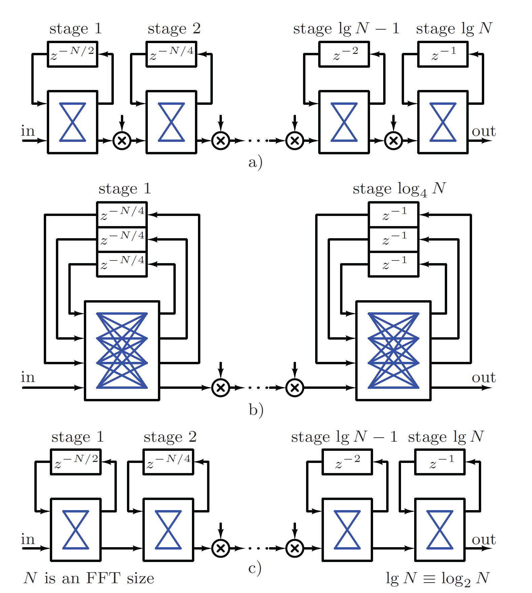
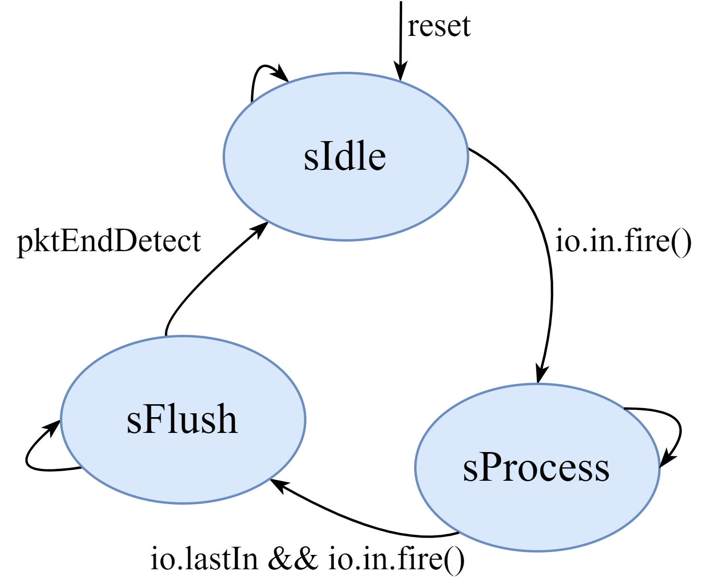
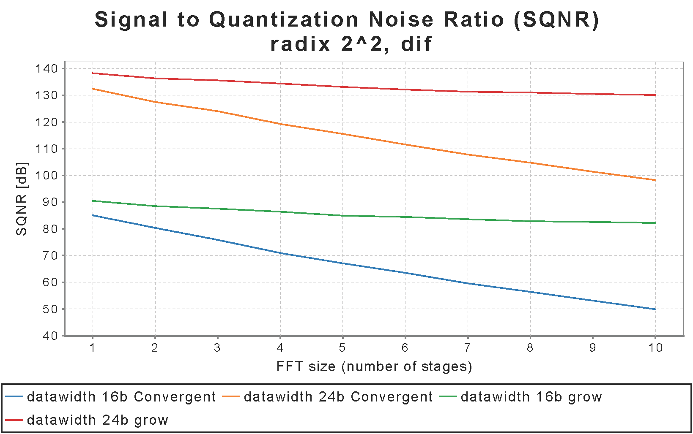
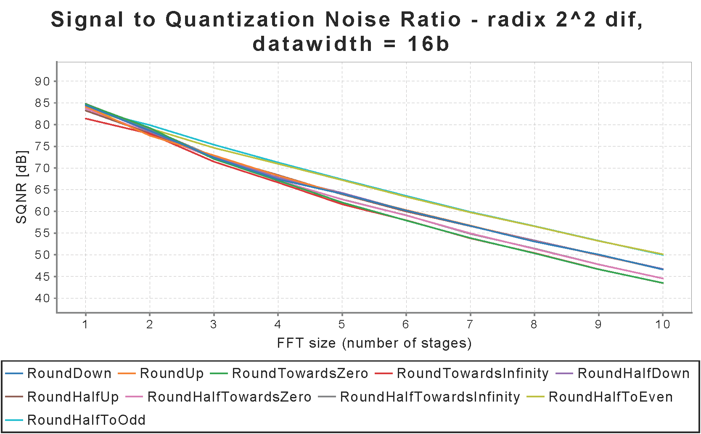

A Single-path Delay Feedback (SDF) FFT Chisel Generator
=======================================================

[](https://travis-ci.org/milovanovic/sdf-fft)

## Overview

This repository contains a highly parameterizable Single-path Delay-Feedback (SDF) FFT Generator written in [Chisel](www.chisel-lang.org) hardware design language. Single-path Delay-Feedback fully streaming pipelined architecture described by this generator provides a balanced trade-off between occupation of resources and the execution time.

### Single-path Delay Feedback FFT architecture

Two major types of pipelined FFT topologies are multi-path delay commutator (MDC) and Single-path Delay Feedback (SDF). Since butterfly and dragonfly outputs share the same storage with the corresponding inputs, the SDF architecture is generally the preferred one as it requires less memory. The name is derived from the fact that computation outputs are stored in feedback shift registers.

Three most popular SDF schemes are shown below in their simplified form in which additive butterflies and dragonflies have been separated from multipliers.


The first two are fairly classical radix 2 and radix 4 FFT schemes and both require N-1 memory locations. While the latter uses only half of the multipliers it doubles the number of complex adders and has more complicated control. The radix 2<sup>2</sup> combines best of the two, it has the same amount of nontrivial multiplications as radix-4, but the same butterfly structure of radix-2 algorithm.

The Chisel generator in this repository implements radix 2 and radix 2<sup>2</sup> sdf-fft architecture and it is is described with following Scala files available inside`src/main/scala` directory:
* `SDFChainRadix2.scala` - contains dif/dit radix 2 sdf-fft module.
* `SDFChainRadix22.scala` - contains dif/dit radix 2<sup>2</sup> sdf-fft module.
* `SDFChainRadix22RunTime.scala` - contains radix 2<sup>2</sup> module which is used only if full run-time configurabilty needs to be achieved. Additional muxes at each stage are inserted in order to keep same number of multipliers as previous radix 2<sup>2</sup> module and at the same time provide any power of 2 fft size through run time configurability.
* `SDFFFTUtil.scala` - contains definition of the `RegEnableWithReset` and `ShiftRegisterWithReset`. Those objects differ from similar objects defined in [chisel3 util library](https://github.com/freechipsproject/chisel3/blob/v3.3.2/src/main/scala/chisel3/util/Reg.scala) in presence of manual reset. Besides those objects, this file contains  object `Butterfly`, instantiated inside every sdf-fft stage.
* `SDFFFT.scala` - contains top level module `SDFFFT`.
* `SDFFFTParams.scala` - contains parameters definition.
* `BitReversePingPong.scala` - contains ping-pong buffer and does bit-reversed addressing.
* `FFTBlock.scala` - contains description of `FFTBlock`.
* `FFTBlockWithWindowing.scala` - contains description of `FFTBlockWithWindowing` AXI4DspBlock. Inside module, memory for window coefficients is instantiated where memory mapped AXI4 bus is used for writing data into the memory.
## Interface of the SDF-FFT Chisel Generator

Interface of the implemented SDF-FFT generator showing inout signals as well as control and status registers is presented in the figure below.


#### Inputs

[Decoupled](https://github.com/freechipsproject/chisel3/wiki/Interfaces-Bulk-Connections) interface is used where .bits is input IQ sample (in time or frequency domain depending on fft direction)
* `in: Flipped(Decoupled(DspComplex[T]))` - input IQ sample (in time domain - direct fft or in frequency domain - inverse fft) wrapped with valid/ready signals
* `lastIn: Bool` - indicates the last sample in the input stream and triggers data flushing
* Optional control registers: `fftSize` , `fftDirReg`, `keepMSBorLSBReg`, `doWindowing`

#### Outputs

Decoupled interface is used where .bits is output IQ sample (in frequency or time domain depending on fft direction)
* `out: Decoupled(DspComplex[T])` - output IQ sample (in frequency domain - direct fft or in time domain - inverse fft) wrapped with valid/ready signals
* `lastOut: Bool` - indicates the last sample in the output stream
* `busy: Bool` - status register, active in the state `sFlush`
* Optional status register: `overflowReg`

#### FSM and Control Logic

Simple state machine which controls data flow is shown below.


On the FSM diagram some signals are omitted for clarity but brief explanation of the each state is given below:
* `sIdle` - reset state and some register initializations are done in this state. System stays in `sIdle` until fire signal (`io.in.ready && io.in.valid`) from input side doesn't assert.
* `sProcess` - state for data processing. When `io.in.fire` is not active, system stays in this state but counters predetermined for stages control are freezed. Transition from `sProcess` to `sFlush` state happens if  `lastIn`and `io.in.fire`signals are activated.
* `sFlush` - in this state data flushing is active. Once when `lastOut` (indicating last sample in the output stream) is asserted, FSM transits to `sIdle` state.

Explanation of some important control signals inside the design:

* `enableInit`  is enable signal for first stage. It is active when `io.in.fire` is asserted, when flushing data is activated and output side is ready to accept new data (`io.out.ready` is activated). Condition for `io.out.ready` is there to be sure that data is not going to be dropped when flushing is in the process. Enable signal for the each stage is delayed version of the `enableInit` where depth of the delay line depends directly of the number of the pipeline registers inserted after each stage.
* `initialOutDone`in active state indicates that last stage will have first valid data on output after passing data through pipeline registers.

Assumption is that `lastIn` is always asserted at the end of the fft window. Preceding block or preceding logic should take care of correct `lastIn` signal generation and potential addition of the zero padding feature.

The SDF-FFT core is ready to accept new data as far as all delay buffers are filled or output side is ready to accept data. When flush is issued then core responds by deasserting ready signal until it's returned to `sIdle` state.

Initial latency of the core depends directly on fft size, number of included pipeline register, multiplier structure as well as of the parameter `useBitReverse`.  It has the same value for radix 2 and radix 2<sup>2</sup> scheme and for both DIT and DIF butterfly types.

|        Parameters settings                             | Initial Latency
|:-----------------------------------------------:|:-----------:|
| `use4Muls` = true  && `useBitReverse` = false       |  (2 \* `numAddPipes` + `numMulPipes`)  \* log<sub>2</sub>(`numPoints`) + `numPoints`                                                   |
| `use4Muls` = true  && `useBitReverse` = true        |     (2 \* `numAddPipes` + `numMulPipes`)  \* log<sub>2</sub>(`numPoints`)  + 2 \*`numPoints`                                                  |
| `use4Muls` = false  && `useBitReverse` = false      |   (3 \* `numAddPipes` + `numMulPipes`)  \* log<sub>2</sub>(`numPoints`) + `numPoints`                                                             |
| `use4Muls` = false  && `useBitReverse` = true       |   (3 \* `numAddPipes` + `numMulPipes`)  \* log<sub>2</sub>(`numPoints`)  + 2 \* `numPoints`                                                                   |

**Note**: If run time configurability is included then `numPoints` inside table should be replaced by register value used for fft size configuration.
#### Dsp Block

The whole SDF FFT generator is wrapped as generic DSP block in a diplomatic interface which is actually AXI4-Stream for inputs and outputs and optional memory-mapped bus (TileLink, AXI4, APB or AHB) for control and status registers. Appropriate Chisel code which does above mentioned wrapping is available inside `FFTBlock.scala`.

## Parameter settings

Design parameters are defined inside `case class FFTParams`. Users can customize design per use case by setting the appropriate parameters.
The explanation of each parameter is given below:
* `numPoints` - number of points in FFT
* `protoTwiddle` - twiddle data type
* `protoIQ` - input data type
* `protoIQstages` - define data type for the each stage separately
* `fftType` - this version supports only sdf-fft
* `decimType` - choose "dit" (decimation in time) or "dif" (decimation in frequency) butterfly type
* `sdfRadix` - radix (current version supports radix 2 and radix 2<sup>2</sup> sdf-fft)
* `expandLogic` - define grow logic at each stage (0 denotes no grow, 1 denotes increase data width of the current stage by one bit)
* `runTime` - enable logic for run time configurable fft size . The control register `fftSize` is used for setting number of active radix stages. This number can be changed only when state machine is in the state `sIdle`.
* `runTimeR22` - enable full run time configurable fft size for radix 2<sup>2</sup> (module `SDFChainRadix22RunTime` is instatiated)
* `keepMSBorLSB` - keep MSB or LSB bit after butterfly operation. If grow logic is used this parameter does not have an effect.
* `keepMSBorLSBReg` - if it is true, include `keepMSBorLSBReg` control register
* `overflowReg` - if it is true, include `overflowReg` status register
* `trimType` - define trim type (one of the eleven trim types) used in butterfly scaling operation
* `numAddPipes` - number of pipeline registers after add/minus operation
* `numMulPipes` - number of pipeline registers after multiplication operator
* `fftDir` - define whether direct or inverse fft should be calculated
* `fftDirReg` - include control register `fftDirReg` for run time configurable fft direction
* `use4Muls` - use 3 or 4 multiplier structure for complex multiplication
* `useBitReverse` - include `BitReversePingPong` module
* `minSRAMdepth` - use SRAM for the delay line larger than `minSRAMdepth`
*  `windowFunc`  - define window function - hamming, hanning, blackman, triangular, user specified or no window function

## Prerequisites

The following software packages should be installed prior to running this project:
* [sbt](http://www.scala-sbt.org)
* [Verilator](http://www.veripool.org/wiki/verilator)

## Setup

Clone this repository, switch directory and run tests:
```
git clone https://github.com/milovanovic/sdf-fft.git
cd sdf-fft
sbt test
```
## Tests

Besides main source code, various tests for sdf generator are provided in this repository. In the text below is given list of the files located in `src/test/scala` which describe different testers and test cases:

* `Radix22PlotSpec` - run simple sdf-fft testers and show functionality of the radix 2<sup>2</sup> module without detailed analysis. Running those tests, various plot diagrams are generated and saved inside `"test_run_dir"` directory.
* `Radix22Spec` - test some implementation specific parameters such as pipeline registers complex multipliers, all that for various fft sizes and both decimation types.
* `Radix22RandomSpec` - test sdf-fft generator with random input test signals. Design is tested for two backends `verilator` and `treadle`.
* `Radix22SQNRSpec` - demonstrate how changing fft parameters affect signal to noise quantization ratio (SQNR) in the case of the radix 2<sup>2</sup> generator instance. Analysis is applied on a large random data set. Results of the analysis are presented on diagrams below.


* `Radix22RunTimeSpec` - run testers for run time configurable fft size for the both `SDFChainRadix22` and `SDFChainRadix22RunTime` modules.
* `SDFFFTTester` - contains useful test functions for testing sdf-fft generator. Common tester is used for radix 2 and radix 2<sup>2</sup> design.
* `SDFFFTRunTimeTester` - contains test function which tests run time configurable fft size. Common tester is used for radix 2, radix 2<sup>2</sup> and radix 2<sup>2</sup> module which provides full run time configurability.
* `TesterUtils.scala` - contains useful helper functions for testers such as `getTone`, `getRandSignal`, `calc_sqnr,` plot functions etc.
* `FFTWithWindowingBlockSpec` - tests fft block with windowing, simple test example with `AXI4StreamModel` and `AXI4MasterModel`

Some test examples described above are written for both `FixedPoint` and `DspReal` Chisel data type. The `DspReal` Chisel data type has been used to simulate golden model of the proposed generator.

To run a specific test written in Scala simulation environment for instance `Radix22Spec`, user should execute the following command:
 `testOnly fft.Radix22Spec`.

**Note**: All above described test cases are available for radix 2 sdf-fft module as well.

For plotting FFT/IFFT, SQNR and other graphs, scala library `breeze-viz` has been used. This dependency is added inside `build.sbt`  since `rocket-dsptools` snapshot does not include it.
Tester functions such as `peek`, `poke` and `except`, available inside `DspTester` (check [dsptools Chisel library](http://github.com/ucb-bar/dsptools)), are extensively used for design testing.

Much more useful information about this work can be found inside ["A Highly Parametrizable Chisel HCL Generator of Single-Path Delay Feedback FFT Processors"](https://ieeexplore.ieee.org/document/8889581) paper published on International Conference on Microelectronics, MIEL 2019.

[comment]: <> (TODO: Check whether radix 2^2 full run time configurability has a better performances and resource utilization than radix 2 with run time configurability
)
[comment]: <> (dev branch - branch for further improvements and testing)

[comment]: <> (TODO: Exclude files with windowing. New block "streaming windowing function" does that)

<!--- In addition to current plots which give SQNR vs Number of Stages for different rounding types after the adder, add analysis for twiddle factor multiplication rounding/truncation. Also analyze the SQNR for a realistic case of 12-bit digital I and Q input (from an ADC) up to 16-bit after, say, 10 butterfly stages (for 1024 points FFT) with options of growing up to 22 bits and then truncate to 16 or grow to 16 and then keep them constant. 16 bits is to fit the 32-bit AXI4-Stream. Compare SQNR against resource utilization. This is for SIPS 2023.)
-->

## Generate verilog

To generate verilog code for all instances of interest, run `make gen_all_single_file`  (all modules are inside one verilog file) or `make gen_all_multiple_files` (each module is inside their own verilog file) in base directory. All verilog files are generated inside `generated-rtl` directory.

* `generated-rtl/radix2` - sdf-fft with butterfly structure radix 2
* `generated-rtl/radix22` - sdf-fft with butterfly structure radix 2^2

Each sub-directory contains `fft_mem.conf` where sram blocks used in design are listed. Top level modul is always `SDFFT_[fft_size]_[word_size]`.
Sub - directory name is always:

`sdffft_size_[fft_size]_width_[word_size]_bitreverse_[useBitReverse]`

When `useBitReverse` parameter is set to 1, additional  SRAM memories are used in design and it is expected that total area is increased.


